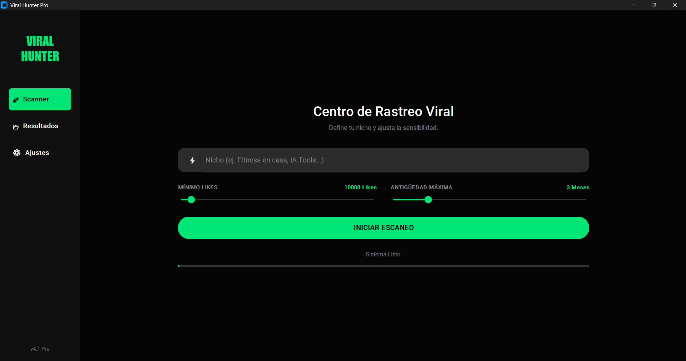

<div align="center">


# 🎯 Viral Hunter Pro

### Scraper de Videos Virales de TikTok

**Aplicación de escritorio en Python** que te ayuda a encontrar **videos virales de TikTok** para inspirar tu estrategia de contenido.

[](https://www.python.org/)
[](LICENSE)
[](https://www.microsoft.com/windows)

</div>

---

## 📸 Vista Previa



---

## ✨ Características Principales

- 🤖 **Gemini (Google Generative AI)** para generar keywords virales (ES / EN / PT)
- 🕷️ **Apify (TikTok Scraper)** para scrapear videos reales de TikTok
- 📊 **Filtros avanzados** por likes mínimos y antigüedad máxima
- 🖥️ **Interfaz gráfica moderna** con CustomTkinter
- 📥 **Exportación a Excel** con columnas optimizadas para análisis
- 🎴 **Tarjetas visuales** de cada video (miniatura, autor, likes, fecha, keyword)
- 🔗 **Acceso directo** a videos en TikTok

---

## 🔍 ¿Qué hace exactamente la herramienta?

1. **Escribes un tema principal** (ej: `Ácido hialurónico`, `Acné hormonal`, `Rutina skincare`, etc.)
2. **La app llama a Gemini** y genera unas **keywords**:
   
3. **Con esas keywords**, la app llama al actor de Apify `clockworks/tiktok-scraper` y descarga videos de TikTok relacionados
4. **Filtra los resultados**:
   - ✅ Solo mantiene videos con **X likes mínimos** (configurable)
   - ✅ Solo incluye videos de los **últimos Y meses** (configurable)
   - ✅ Elimina **duplicados por URL**
5. **Te muestra los videos en forma de tarjetas**:
   - Miniatura (imagen de portada)
   - Título / descripción
   - Fecha de publicación
   - Número de likes
   - Autor
   - Keyword con la que mejor encaja
   - Botón para **abrir directamente en TikTok**
6. **Puedes exportar los resultados a Excel** con columnas pensadas para trabajo de análisis y contenido

---

## 🧩 Requisitos Previos

Antes de instalar, asegúrate de tener:

- 🐍 **Python 3.9 o superior** instalado
- 💻 **Sistema Operativo**: principalmente pensado para **Windows** (usa `start <url>` para abrir el navegador)
- 🌐 **Conexión a Internet** (para Gemini y Apify)
- 🔑 **Cuentas activas en**:
  - [Gemini / Google Generative AI](https://ai.google/)
  - [Apify](https://apify.com/), con acceso al actor `clockworks/tiktok-scraper`

---

## 🛠️ Instalación

> **Importante:** todos estos pasos se realizan **dentro de la carpeta del proyecto**, donde está el script principal.

### 1️⃣ Clonar o descargar el proyecto

**Si lo tienes en un `.zip`:**
- Descomprime el archivo en alguna carpeta, por ejemplo:  
  `C:\Users\TU_USUARIO\Desktop\Virales tiktok scrapper\Viralhunter`

**Si usas Git (opcional):**

```bash
# Clona el repositorio (ejemplo)
git clone https://tu-repo.git

# Entra en la carpeta del proyecto
cd Viralhunter
```

### 2️⃣ Crear entorno virtual (Recomendado)

En Windows (PowerShell o CMD):

```bash
# 1. Crear un entorno virtual llamado "venv"
python -m venv venv

# 2. Activar el entorno virtual
venv\Scripts\activate

# Si ves (venv) al inicio de la línea, el entorno está activo ✅
```

### 3️⃣ Instalar dependencias

Dentro de la carpeta del proyecto y con el entorno virtual activo:

```bash
# Instalamos todas las librerías necesarias desde requirements.txt
pip install -r requirements.txt
```

**El archivo `requirements.txt` incluye:**
- `customtkinter` → interfaz gráfica moderna
- `requests` → descarga de imágenes y llamadas HTTP
- `pandas` → manejo de datos y exportación a Excel
- `Pillow` → manejo de imágenes (miniaturas)
- `google-generativeai` → conexión con Gemini
- `apify-client` → conexión con Apify
- `openpyxl` → para poder guardar archivos `.xlsx`

---

## 🔑 Configuración de las APIs

Necesitas dos claves:

- 🔐 **Gemini API Key** (Google Generative AI)
- 🔐 **Apify API Token** (con acceso al actor `clockworks/tiktok-scraper`)

### Opción A – Configurarlas desde la app (Recomendado)

1. Ejecuta la app (ver siguiente sección **"Cómo ejecutar la app"**)
2. En la pestaña **"🔍 Investigación"** verás:
   - Campo `Gemini API Key`
   - Campo `Apify API Token`
3. Pega tus claves en esos campos
4. Cuando ejecutes una búsqueda por primera vez, la app **guardará automáticamente** tus claves en un archivo `config.json` en el mismo directorio del script
   - Así no tendrás que volver a escribirlas cada vez

### Opción B – Configurar `config.json` manualmente

En el mismo directorio donde está el script principal, crea (o edita) un archivo llamado `config.json` con este contenido:

```json
{
  "gemini": "TU_CLAVE_DE_GEMINI_AQUI",
  "apify": "TU_TOKEN_DE_APIFY_AQUI"
}
```

> ⚠️ **Advertencia de seguridad:**  
> No compartas este archivo con nadie y **no lo subas a GitHub u otro repositorio público** con tus claves reales.

---

## ▶️ Cómo Ejecutar la Aplicación

Una vez instaladas las dependencias y configuradas las APIs:

```bash
# 1. (Opcional, pero recomendable) Activar el entorno virtual si no lo está
venv\Scripts\activate

# 2. Asegúrate de estar en la carpeta donde está el script
cd Viralhunter

# 3. Ejecutar la aplicación
python virales.py
# o
python v2.py
```

Si todo está bien, se abrirá la ventana:

> **Viral Hunter Pro 🎯**

---

## 🧭 Guía de Uso

### 🔍 Pestaña "Investigación"

1. **Configuración de APIs**
   - `Gemini API Key`: pega tu clave de Gemini
   - `Apify API Token`: pega tu token de Apify (campo con `*`)

2. **Criterios de Viralidad**
   - **`Tema Principal`**: Escribe el tema que quieres investigar
     - Ejemplos: `Ácido hialurónico`, `Acné hormonal`, `Piel grasa rutina`
   - **`Min. Likes`**: Número mínimo de likes que debe tener un video para ser considerado (ej: `25000`)
   - **`Max. Meses`**: Antigüedad máxima de los videos (en meses) para que se consideren actuales (ej: `6`)

3. **Iniciar búsqueda**
   - Haz clic en `🚀 INICIAR BÚSQUEDA INTELIGENTE`
   - Verás en la parte inferior un **log paso a paso**:
     - Consulta a la IA (Gemini)
     - Scraping de TikTok (Apify)
     - Aplicación de filtros
     - Número de videos encontrados
     - Posibles errores

4. **Cuando termina:**
   - Se habilita la pestaña **"📊 Resultados"**
   - La app cambiará automáticamente a esa vista

### 📊 Pestaña "Resultados"

En esta sección verás:

- Un contador: `Resultados: N` (cantidad de videos cualificados)
- Botón `📥 Exportar Excel`
- Un listado scrollable de **tarjetas**, cada una mostrando:
  - 📷 Miniatura del video
  - 📝 Título / descripción
  - 📅 Fecha de publicación
  - ❤️ Número de likes
  - 👤 Autor
  - 🔍 Keyword asociada
  - 🔗 Botón `Ver en TikTok ↗` que abrirá el video en tu navegador

#### 💾 Exportar a Excel

1. Haz clic en `📥 Exportar Excel`
2. Elige:
   - Carpeta donde guardar
   - Nombre del archivo (por defecto: `Virales_<Tema>_<YYYYMMDD>.xlsx`)
3. El archivo se generará con columnas como:
   - `TITULO (contexto)`
   - `🎯 ENLACE DE REFERENTE`
   - `FECHA DE PUBLICACION`
   - `LIKES`
   - `ENLACE TUYO` (columna vacía para que añadas tu propio contenido)
   - `PALABRAS CLAVE`
4. Si todo sale bien, verás un mensaje de éxito con la ruta del archivo

---

## ⚠️ Notas, Límites y Consideraciones

- 💰 **Costes de API**:
  - Tanto Gemini como Apify pueden consumir saldo, créditos o cuota de tus cuentas
  - Revisa tus planes para evitar sorpresas en facturación

- 🔐 **Seguridad de claves**:
  - Las claves se guardan en `config.json` en texto plano en tu máquina
  - No compartas ese archivo ni lo subas a repos públicos

- 🕒 **Tiempos de espera**:
  - El scraping de TikTok puede tardar varios minutos dependiendo del número de keywords y resultados
  - La app usa **threads** para que la interfaz no se congele mientras tanto

- 🧪 **Plataforma**:
  - Está optimizada para Windows (`os.system("start <url>")` para abrir el navegador)
  - En otros sistemas (`macOS`, `Linux`) puede requerir pequeños ajustes

---

## 🙋‍♂️ Soporte y Mejoras

Si quieres:
- Añadir nuevos filtros (por país, por hashtag específico, etc.)
- Cambiar el número de keywords generadas
- Integrar otros scrapers o redes

Puedes modificar los archivos principales:
- La lógica principal está en la clase `ViralLogic`
- La interfaz está en la clase `ViralHunterApp` y el componente `VideoCard`

---

<div align="center">

**Hecho con ❤️ para creadores de contenido**

</div>
